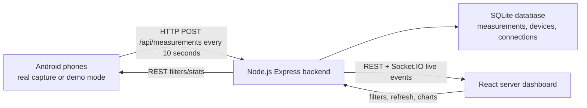

# Architecture

## Android Client

The Android app requests phone and location permissions, captures the currently registered cell when Android exposes it, renders the latest sample locally, and immediately sends the sample to the backend. Measurements are not stored in an Android database.

Demo mode uses realistic generated Alfa/Touch, 2G/3G/4G/5G, power, SNR, and cell data. This makes the demo reliable even in an emulator or when Android blocks radio details.

## Backend

Node.js handles multiple concurrent HTTP clients through its event loop and non-blocking request handling. Express validates and stores measurement samples. Socket.IO pushes live state to dashboards. SQLite uses WAL mode to support the local demo workload cleanly.

The backend owns all durable persistence and all statistics. Android and dashboard clients only request calculated results.

## Dashboard

The React dashboard is the server-side interface required by the project. It displays live operational state, connected devices, historical rows, filters, ratios, and charts.

## Privacy And MAC Address Limitations

Android versions used today do not generally expose real device MAC addresses to normal apps. The project tracks device identity using Android secure ID, session ID, server-observed IP, and phone local IP when available. This is the practical and privacy-compliant equivalent for the course dashboard.
